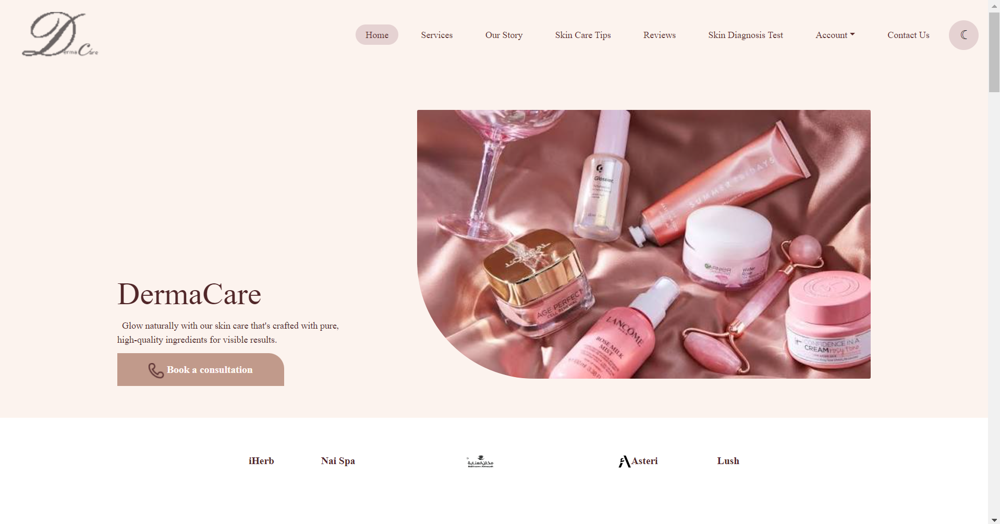
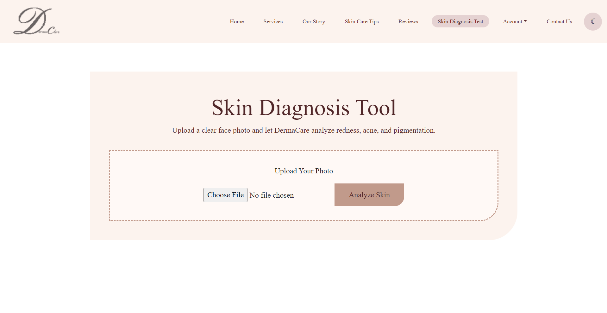

# **DermaCare — Dermatology Web Application**

## **Overview**
DermaCare is a full‑stack dermatology web application designed for **public users** and **clinic employees**.  
Public users can browse the website, explore services, learn about the clinic, and use the skin‑diagnosis tool.  
Employees have access to internal pages that allow them to **add, update, and delete appointments**.

This separation creates a realistic, secure workflow similar to real clinics where staff manage scheduling.

---

## **Purpose**
DermaCare provides:
- A clean, user‑friendly interface for visitors  
- A controlled appointment management system for employees  
- A structured backend using Node.js + Express  
- A MySQL database for storing user and appointment data  
- Automatic server reloading using **nodemon** for faster development  

---

## **User Roles**

### **1️ Public Users**
Public visitors can:
- View the **Home** page  
- Explore **Services**  
- Read the **Our Story** page  
- Use the **Skin Diagnosis** tool  
- Contact the clinic  
- Create an account  
- Log in  
- View their **Profile**

They **cannot** book appointments directly.

### **2️ Employees**
Authorized staff can:
- Add new appointments  
- Update existing appointments  
- Delete appointments  
- View all scheduled appointments  

---

## **Features**

### **Public Features**
- Responsive home page  
- Services overview  
- Clinic story  
- Contact page  
- Skin diagnosis tool  
- User signup & login  
- Profile page
- Support dark mode  

### **Employee Features**
- Add appointment  
- Update appointment  
- Delete appointment  
- Appointment dashboard  

---

## **Tech Stack**

### **Frontend**
- HTML  
- CSS  
- JavaScript  

### **Backend**
- Node.js  
- Express.js  
- Nodemon (development auto‑reload)

### **Database**
- MySQL  

---

## **Project Structure**

```
DermaCare/
│
├── public/
│   ├── css/
│   ├── js/
│   ├── images/
│   ├── fonts/
│   └── *.html
│
├── index.js
├── package.json
└── dermacare.sql
```

---

## **How to Run Locally**

### **1. Install dependencies**
```
npm install
```

### **2. Start the server (development mode with nodemon)**
```
nodemon index.js
```

### **3. Or start without nodemon**
```
node index.js
```

### **4. Open in browser**
```
http://localhost:3000
```

---

## **Screenshots**






---

## **Future Improvements**
- Add patient appointment booking  
- Add admin dashboard  
- Add appointment reminders  
- Add AI‑powered skin diagnosis  
- Add role‑based authentication (employee vs user)  
- Add analytics dashboard  

---
## Contributors

- Norah Bin Salamah  
- Sara Almuraibidh
- Danyah Alsabti 
- Sitah Alsemmari 

